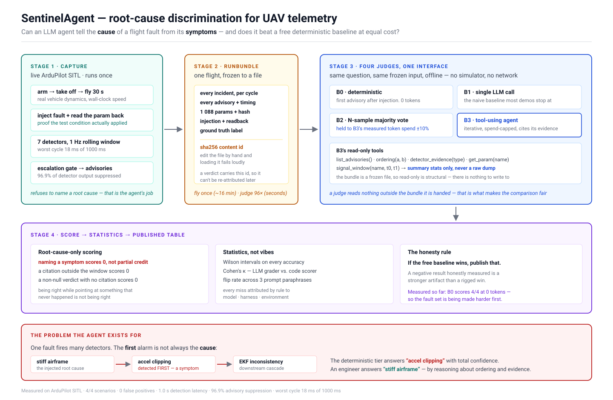

# SentinelAgent — root-cause discrimination for UAV telemetry

[](https://github.com/RahulRajelli/sentinel-realtime/actions/workflows/tests.yml)
[](https://github.com/RahulRajelli/sentinel-realtime/actions/workflows/codeql.yml)
[](LICENSE)
[](pyproject.toml)
[](QUICKSTART.md#4-reproduce-the-headline-result)

> The last badge is the point of the project, not decoration: `B0` is a free deterministic rule
> with no model in it, and on this fault it is wrong every single time.

A drone's compass breaks at 8.0 s. At 9.0 s the navigation filter complains. At 10.0 s the compass
detector finally reports the compass — a full second after the alarm it caused, because that
detector waits a second before speaking, to avoid crying wolf.

So *"whatever alarmed first is the cause"* — free, no AI, right on most faults — is wrong here
every time, and wrong by construction rather than by luck. That makes it a baseline an expensive
method has to actually beat. It scores **0.00**.

Rendered: **[rahulrajelli.github.io/sentinel-realtime](https://rahulrajelli.github.io/sentinel-realtime/)**

| | |
|---|---|
| Not technical | [Why the first warning lies](https://rahulrajelli.github.io/sentinel-realtime/whitepaper-plain.html) |
| Want to run it | [QUICKSTART.md](QUICKSTART.md) — 5 minutes, no drone, no API key |
| Want to attack the method | [The discriminating pair](https://rahulrajelli.github.io/sentinel-realtime/whitepaper-technical.html) |
| Building your own eval | [docs/METHOD.md](docs/METHOD.md) — nothing in it is about drones |
| Flying ArduPilot | [docs/SETUP.md](docs/SETUP.md) |
| Contributing | [CONTRIBUTING.md](CONTRIBUTING.md) |

Can an LLM agent tell the **cause** of a flight fault from its **symptoms** — and does it beat a
free deterministic baseline **at equal cost**?

This repository is two things: a fault-detection tool you can point at a flight log today, and
the harness that answers that question honestly — including when the answer is "no".



---

## Start here

> ### → **[QUICKSTART.md](QUICKSTART.md) — five minutes, no drone, no API key**
>
> You do not need hardware to check that any of this is true. The flights are captured and
> committed, so you can install it, run 218 offline tests, and reproduce the headline result
> (`B0 = 0.00`) entirely on your own machine. Start there if you want to verify the claim before
> reading the argument for it.

> **ArduPilot only.** Live telemetry uses the `ardupilotmega` dialect and log analysis reads
> ArduPilot dataflash `.BIN` files. **PX4 is not supported** — it would run and find nothing,
> which is worse than refusing. Full setup, per-platform connection recipes and troubleshooting:
> **[docs/SETUP.md](docs/SETUP.md)**.

```bash
pip install git+https://github.com/RahulRajelli/ardupilot-log-analyzer
pip install git+https://github.com/RahulRajelli/sentinel-realtime
sentinel analyze YOURFLIGHT.BIN
```

Two commands, because the detectors (`flightdx`) are useful without the realtime tier and live in
their own repository. Python 3.11+, no simulator, no MAVLink link, no API key, no account. If
anything is missing, `sentinel doctor` names the piece and the fix.

> **PyPI is not live yet.** Both packages build and pass `twine check`, and `pip install
> sentinel-realtime` will be the single command once they are published. Until then the two lines
> above are the install, and they are what gets tested.

For development, clone the two as siblings and `pip install -e` each; `conftest.py` adds the
sibling `src/` tree to the path so the tests run either way.

It reads the `.BIN` files already on your SD card.
Real output, from a real 3.4 MB log:

```
FLIGHT REPORT  |  2024-04-30 17-30-57.bin
  parameters loaded : 1088
  message types     : 58

  2 finding(s), most serious first:

  !  battery_threshold_misconfigured   [warning]   1 occurrence(s), first at t=463.6s
       what it means : The configured battery failsafe thresholds look inconsistent with the pack.
       what to check : Review BATT_LOW_VOLT / BATT_CRT_VOLT against the pack's real chemistry.
       evidence      : BATT_LOW_VOLT = 10.5 V (threshold 22.2 V)

  !  compass_inconsistency   [warning]   3 occurrence(s), first at t=488.6s
       evidence      : MagFieldDeviation = 0.397 fraction (threshold 0.35 fraction)
```

That first finding is a 3S low-voltage failsafe left configured on a 6S pack — the failsafe
would never have fired. **Every finding prints its evidence**: the measured value against the
threshold that was actually loaded on the aircraft, so you can check it rather than trust it.

| Command | What it does |
|---|---|
| `sentinel doctor` | Checks your machine, names the exact fix for anything missing |
| `sentinel analyze FLIGHT.BIN` | Analyses a log you already have |
| `sentinel replay FLIGHT.BIN` | Replays a real flight **through the realtime tier** (below) |
| `sentinel watch --conn COM5,57600` | Live over a radio, WiFi (`udp:0.0.0.0:14550`) or SITL |
| `sentinel capture / judge / report` | The research path (below) |

Add `--html report.html` to `analyze` or `replay` for a self-contained report you can email —
no CDN, no fonts, no scripts, so it opens on a hangar machine with no network.

### `replay` — because injected faults are not real faults

SITL injects a fault by setting a `SIM_*` parameter: a clean synthetic step at a known instant.
Real faults ramp, intermit, and arrive tangled with wind and throttle changes. A harness measured
only on injected faults measures how well it detects injections.

`replay` drives the **same** rolling buffer, the **same** seven detectors and the **same**
escalation gate from a real `.BIN`. It needs no simulator, no WSL and no ArduPilot toolchain, so
a stranger with the same log can reproduce your result exactly — `bundle_id` is a content hash
over what the flight contained, deliberately excluding wall-clock timings so it fingerprints the
flight rather than the machine.

```
140 cycles · 346 raw detections · 11 advisories · 96.8% suppressed by the gate
```

**That 96.8% is worth pausing on.** The escalation gate measured **96.9% on injected SITL faults**
and **96.8% on a real flight** — produced independently, on completely different data. It is the
first evidence the gate behaves the same on real telemetry as on synthetic.

A replay deliberately does **not** set a ground-truth label. It records what was seen; a human
labels what it means. Deriving the label from the detector output would grade the system against
its own opinion.

`watch --passive` listens at whatever rate your ground station already set and skips the
parameter fetch — for shared radio links where raising stream rates would congest the pilot's
own telemetry. It says so, rather than quietly degrading: without the aircraft's parameters,
actuator and battery verdicts are unreliable.

---

## The problem the agent layer exists for

One fault trips several detectors, and the fastest detector is not the one that is right. A
magnetometer offset raises EKF variance immediately, while the compass detector waits a full
second to confirm the anomaly is sustained. A mistuned attitude loop drives the motors to their
limits, and `actuator_saturation` is advised **1.719 s** before `control_oscillation`, because
the oscillation detector needs two consecutive 1.5 s windows before it may speak.

In both cases the **first** alarm is a symptom, and the deterministic tier answers it with total
confidence. The second case is the expensive one: the symptom reads as a motor or ESC fault and
the cause means detune the controller. **Opposite actions.** On the ground that is a wrongly
swapped ESC; in the air, "motor failure" on a quad can mean shutting a motor down.

That gap is also why root cause is not the only question worth asking. The action that is correct
under *both* readings is decidable at the symptom, deterministically, with no model in the loop —
**[docs/SAFE-ACTION-SPEC.md](docs/SAFE-ACTION-SPEC.md)** specifies it, including the hole in its
own evaluation.

> **The generalisable part is not about drones.** Most evaluations beat a baseline that is weak by
> accident, so "the expensive method won" is a sampling result rather than a structural one. Here
> the free rule is wrong *by construction*: a detector's persistence gate places the causal
> advisory 1.0 s after the symptom it produced, so "the first alarm is the cause" scores 0.00 and
> cannot be tuned into agreement. That method transfers to any domain with a cheap heuristic worth
> beating — **[docs/METHOD.md](docs/METHOD.md)** is how to build one, including the shortcut that
> makes it worthless (adjusting the system until the baseline fails).

## How the measurement works

**Capture and judgment are separated.** Flying an ArduPilot SITL scenario takes ~4 minutes;
comparing four judges across three prompt paraphrases takes ~96 judgments. So a flight is
captured once into a content-hashed `RunBundle`, and every judge runs offline against the file.

| Stage | What |
|---|---|
| **Capture** | Live SITL → 7 detectors at 1 Hz → escalation gate → advisories. Fault injected with **parameter readback**, so the test condition is proven, not assumed |
| **RunBundle** | Every incident, advisory, parameter and timing from one flight, sha256-identified. Hand-edit it and loading fails |
| **Judge** | **B0** deterministic · **B1** single LLM call · **B2** N-sample at B3's measured spend · **B3** tool-using agent |
| **Score** | Root-cause-only. Naming a symptom scores 0 |
| **Stats** | Wilson intervals, Cohen's κ, bootstrap CI, prompt flip rate, rule-based failure attribution |

### The rules that make the number mean something

- **Naming a symptom scores zero**, not partial credit. That confusion is the thing being measured.
- **A correct answer with an unresolvable citation scores zero.** Being right while pointing at
  something that never happened is not being right.
- **B2 is held to B3's measured token spend.** A comparison that doesn't control for spend
  measures spend. The *achieved* match is published, not the intended one.
- **A degraded run stays labelled B3.** Relabelling it would delete the agent's failures.
- **The ground-truth label is unreachable.** The tool surface is an allow-list and no prompt
  names a fault type; tests assert it against the full transcript the model saw.
- **If the free baseline wins, that gets published.**

---

## Model choice and running cost

**The escalation gate is what makes this cheap.** It absorbs **96.9%** of raw detector output, so
the LLM is invoked per *escalation*, not per cycle — on the order of tens of calls a day for a
100-aircraft fleet, not tens of thousands.

**Every judge talks to a one-method interface** (`ModelClient.complete()` in
`sentinel/judges/model.py`). Swapping the model — or the provider entirely — is implementing that
one method. `ScriptedClient` and `DryRunClient` already do, which is how the whole test suite
runs at zero cost.

**The number that decides this is not cost per judgement. It is cost per CORRECT answer.**
`scripts/e4_cost.py` regenerates everything below from committed verdict files and spends nothing.

**Nine models, one frozen arm** (B3, `compass_offset`, variants v1/v2/v3 — identical prompts and
tools, so any difference in spend is the model rather than the task):

| model | runs | tok/judgement | acc | **tok/correct** |
|---|---|---|---|---|
| `gemini-3.7-flash` | 5 | 5,138 | 1.00 | **5,138** |
| `zai-glm-5.2` | 5 | 5,199 | 0.98 | **5,317** |
| `grok-4.6` | 5 | 6,955 | 0.82 | **8,459** |
| `qwen3.8-max` | 5 | 5,753 | 0.67 | **8,630** |
| `kimi-k3` | 5 | 6,020 | 0.67 | **9,030** |
| `gemini-2.5-flash` | 10 | **4,652** | 0.46 | **10,211** |
| `claude-sonnet-5` | 5 | 10,435 | 0.91 | **11,453** |
| `deepseek-v4-pro` | 5 | 5,287 | 0.44 | **11,895** |
| `deepseek-v4-flash` | 10 | 5,521 | 0.18 | **31,055** |

**The cheapest model per judgement is not the cheapest model per right answer.**
`gemini-2.5-flash` is the cheapest thing to call at 4,652 tok and lands sixth once accuracy is
priced in. `gemini-3.7-flash` costs more per call and is the cheapest per correct answer.
Best to worst is **6x**, and a model-selection decision made on the tok/judgement column alone
would have picked the wrong model.

`claude-sonnet-5` is the case worth understanding: **0.91 accuracy, and seventh on cost.** It is
accurate and verbose, and per-token pricing punishes verbosity independently of whether the answer
is right. Accuracy tables hide this entirely.

**Within one model, across arms** — the same measure applied to the judge tiers:

| arm | B1 tok/correct | B3 tok/correct | |
|---|---|---|---|
| `gpt-5.6-sol` untimed | 1,089 | 2,250 | B3 costs 2.07x and earns it (0.71 -> 0.96) |
| `gemini-2.5-flash` variance | 4,026 | 5,802 | B3 costs 1.44x and is **worse** (0.91 -> 0.69) — strictly dominated |

**Caveat that travels with every row: these are `compass_offset` only.** Seven of the nine models
have never been measured on a second fault, and on pair C the two that have both collapse to 0.00.
The ranking is a ranking on one mechanism.

The estimated-price table below predates all of this and is arithmetic, not observation. Trust
the script.

| | Opus-tier ($5/$25 per MTok) | Haiku-tier ($1/$5 per MTok) |
|---|---|---|
| One agent judgement (~5 calls) | ~$0.12 | ~$0.025 |
| Full sweep (12 bundles × 3 variants × 4 judges + grader) | **~$10** | ~$2 |
| Fleet operation (~40 escalations/day) | ~$5/day | ~$1/day |

**So cost is not the binding constraint here — capability is.** A full experimental sweep costs
about what a coffee does. Picking a cheaper model *before* measuring which model can do the task
at all would be optimising the wrong variable. Run the sweep on the capable model first; the
table will tell you how much headroom a cheaper one has.

**On free and local models.** The interface is provider-agnostic, so a local server (llama.cpp,
Ollama, vLLM) is a legitimate `ModelClient`. Two honest caveats: small local models are
substantially weaker at *reliable tool use*, which is exactly what B3 needs, and an 8 GB consumer
GPU limits you to ~8B quantised. The realistic use is a local model as an **extra B1-style row**
in the table — a cheap single-shot baseline — not as the agent. And that is a measurement, not a
guess: add the row and the scorer will tell you.

**On fine-tuning.** Not yet viable, and worth saying plainly: fine-tuning needs training data,
and this repo has a handful of scenarios. Anything trained on that overfits. Revisit when the
task set is 60–150 items — at which point the more valuable artifact is the *labelled set*
itself, not the tuned model.

---

## Status — honest

**Measured on ArduPilot SITL:** 5/5 scenarios pass · 0 false positives · 1.0 s detection latency
(vibration), 5.0 s (GPS loss), 3.1 s (pair C) · 96.9–98.6% advisory suppression · worst cycle
**118 ms of 1000 ms**.

**The deterministic baseline is no longer perfect, and that is the point.** B0 scores **4.0 / 5**:
1.00 on `null`, `vibration`, `gps_loss` and `wind`, and **0.00 on `hot_gains_lowd`**, where it
answers `actuator_saturation` — the symptom — instead of `control_oscillation`. Until that fault
existed the root cause's own detector always fired first, B0 won or tied everything, and there was
nothing for an agent to be better at.

**One judge has now beaten it, and only one.** A single read-only tool, `exceedance_ranking`, took
`gpt-5.6-sol` B3 from **0.00 to 0.53** on that fault while the `compass_offset` control held at
**0.98** — helpful where it discriminates, harmless where it does not. The same tool moved
`gemini-3.7-flash` **not at all** (0.00, symptom named 15/15). So the finding is not "the tool
surface was the bottleneck"; it is that **a tool surface cannot be evaluated apart from the model
consuming it**. The tool stays in `OPTIONAL_SPECS` and a test asserts it is not in the default.

**Judge numbers exist and are published**, with the caveats attached. Two of those caveats change
how every number here should be read:

* **Name the model AND the route.** The same model, same arm, same prompts scored **0.11 via Google
  ADC and 0.46 via an OpenAI-compatible gateway.** A result that names only the model may simply be
  false.
* **The cross-model accuracies describe the judges on `compass_offset`**, the only fault they were
  measured against before pair C existed. On pair C, `gpt-5.6-sol` B3 goes 0.96 → 0.00 and
  `gemini-3.7-flash` 1.00 → 0.00, naming the symptom on 30 of 30 judgements.

**[WHITEPAPER.md](WHITEPAPER.md) is behind the repository** and is being rewritten. It carries the
cross-model table and five retractions; it does not yet cover pair C, the nine-model prevalence
sweep, the provider effect, cost per correct answer, or retractions six through eight. Until it
does, the reproducible sources are the committed verdict files plus `scripts/e4_cost.py`,
`scripts/e4_prevalence.py`, and the pre-registered probes in
[docs/probe-pairc-e4.md](docs/probe-pairc-e4.md) and
[docs/probe-pairc-tool-surface.md](docs/probe-pairc-tool-surface.md) — each of which committed its
prediction and its falsifier *before* the run.

**Ambiguity is enforced, not assumed.** `stats.ambiguity_worked()` fails the report if a fault set
stops discriminating, and `test_score.py` asserts both halves — B0 perfect on every plain fault, and
failing completely on every ambiguous pair. `stiff_airframe` was **retired** after six flights
proved it was not ambiguous at all: cause and symptom landed in the same 0.25 s cycle every time.
It is kept in the source as the record of what was tried.

**Two things the API does not provide, recorded because they change what the numbers mean:**
sampling parameters are rejected on the current model, so **B2's k samples vary only by the
model's own non-determinism** — it publishes its observed disagreement rate, and a rate of 0
means B2 collapsed into B1 at k× the cost. And there is **no seed**: bundles are deterministic,
verdicts are not, so this is not end-to-end reproducible and does not claim to be.

```
218 tests, all offline — no simulator, no network, no API key
```

## Running the research path

```bash
sentinel capture --bundles bundles --repeat 3 --compare r8_results.json   # needs WSL + SITL
sentinel judge   --bundles bundles --dry-run                              # free, exercises everything
sentinel judge   --bundles bundles                                        # needs an API key
sentinel report  --bundles bundles --verdicts verdicts.json --markdown
```

`--dry-run` runs the entire sweep against a stub that answers "the first advisory" — the naive
strategy — so you see the real shape of the table before spending a token.

### Dependency

The detector tier lives in [`flightdx`](https://github.com/RahulRajelli/ardupilot-log-analyzer)
(ArduPilot log parsing, 7 detectors, evidence schema). This repository is the realtime runner,
the escalation gate, the CLI and the agent evaluation harness on top of it.

A SiK radio cannot carry 13 message types at 10 Hz; below `MIN_ATT_RATE_HZ = 7.0` the oscillation
detector **declines to run** rather than emit an aliased result. That is why the on-vehicle
companion-computer topology exists — detect at full rate, send events down the link, not telemetry.

## Design rules that do not bend

- **No LLM anywhere near flight control.** Judges are offline and read-only *structurally* — the
  bundle is a frozen file, so there is no write path to expose.
- **No RAG, no vector database.** There is no corpus here; adding one would be architecture theater.
- **The uplink is read-and-configure only** — stream rates and parameter fetch. Nothing commands
  the aircraft.

## Licence

Apache-2.0.
